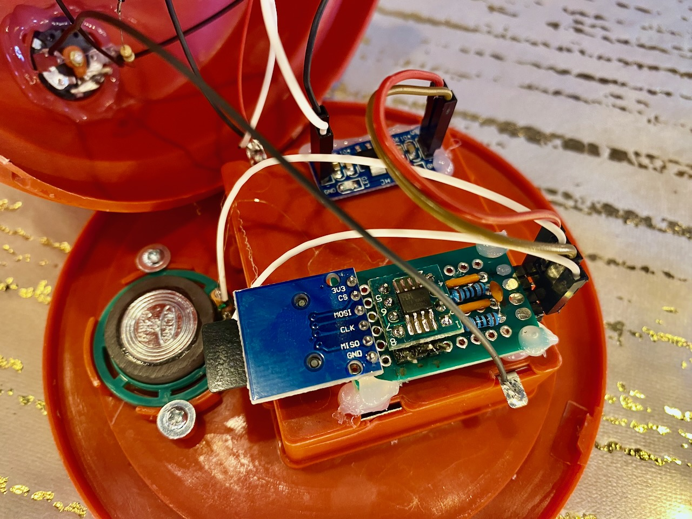
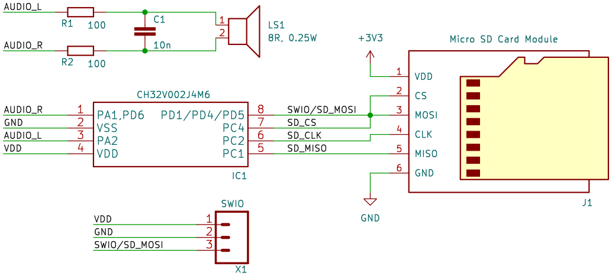

# ch32-Lamp – Music Player for CH32V002 (BeatleBeat)

Music module for playing mono WAV (IMA ADPCM) files from an SD card. Based on the BeatleBeat design from CH32LibSDK,
using the CH32V002x4 MCU. Originally replaces the spooky player from a Christmas lamp that I bought for 7 euros
at a Christmas market. At first glance you might think it's not even worth 7 euros, but a maker immediately sees
an opportunity :).

https://github.com/user-attachments/assets/773d004b-9a88-4d60-8f8c-bc5a34e66562

Unlike the original BeatleBeat design and code, this player works with mono files and uses BTL wiring for louder
output.



Everything from the original "Christmas lamp" is reused, except for the original music player module.

## Features

- Plays mono 22.05 kHz IMA ADPCM WAV from FAT32 SD card, file and folder navigation.
- BTL PWM output on PA1/PA2 for higher volume without external amplifier.
- Files are played from the root directory of the SD card, playback order is determined by the order they were saved to
  the SD card.
- SD card must be formatted as FAT32

## Wiring, Schematic

The lamp runs on 3xAA batteries. CH32V002x4 can handle up to 5V, but unfortunately the SD card cannot. Therefore,
a voltage regulator module was needed, e.g., AMS1117 3.3V module.



**Components**

- AMS1117 3.3V - https://www.laskakit.cz/modul-stabilizatoru-napeti-ams1117-3-3v
- SD card slot - https://pajenicko.cz/ctecka-pametovych-karet-micro-sd-3-dot-3v
- 2x 100R resistor
- 1x 10nF ceramic capacitor - PWM carrier frequency filter (~22kHz)
- 1x MCU CH32V002A4M6
- Universal PCB - https://www.laskakit.cz/20x80mm-oboustranna-pcb-prototypova-deska/
- SOP8 adapter - https://www.laskakit.cz/sop8-so8-soic8-na-dip-adapter/

**Why BTL?**

BTL (Bridge-Tied Load) is a configuration where the speaker is connected between two outputs in anti-phase:

- PA1 outputs the normal PWM signal
- PA2 outputs the inverted PWM signal (value = 2176 – normal value)

Advantages:

- **2× voltage swing** on the speaker compared to single-ended configuration
- **No DC component** - symmetric drive eliminates DC offset
- **Louder sound** without the need for an external amplifier

## WAV Format and MP3 Conversion

- IMA ADPCM, 22.05 kHz, mono, no metadata. Save WAV files to the SD root (searches for *.WAV).
- Batch conversion:

```bash
mkdir out
for f in *.mp3; do
  ffmpeg -i "$f" \
    -af "pan=mono|c0=0.5*c0+0.5*c1,highpass=f=180,acompressor=threshold=-20dB:ratio=3:attack=10:release=200:makeup=12,alimiter=limit=0.9" \
    -c:a adpcm_ima_wav -ar 22050 -ac 1 -map_metadata -1 \
    "out/${f%.mp3}.wav"
done
```

**Audio filter description:**

- `pan=mono|c0=0.5*c0+0.5*c1` - mix stereo to mono (average of L+R)
- `highpass=f=180` - remove deep bass (small speaker can't reproduce it)
- `acompressor` - dynamic range compression for better audibility
- `alimiter=limit=0.9` - peak limiting to prevent clipping
- `-map_metadata -1` - remove metadata (saves space)

## Build

```bash
# Set SDK path
export CH32_ROOT_PATH="../../CH32LibSDK"
# You also need to adjust paths in Makefile
# Build
./c.sh
# Clean
./d.sh
# Clean, Build, Flash (via microchlink)
./x.sh
```

Links:

- CH32LibSDK - https://github.com/Panda381/CH32LibSDK/tree/main
- BeatleBeat - https://www.breatharian.eu/hw/ch32libsdk/#babybeat
