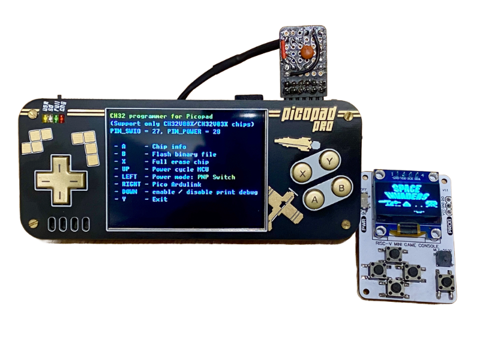

# CH32 Programmer for Picopad

RISC-V microcontroller programmer for WCH CH32V and CH32V00X and CH32V03X series, running on Picopad handheld device.



## Features

- **Programming via SWIO** (Single Wire Debug Interface)
- **Software-controlled power switching** (optional high-side PNP circuit)
- **Configurable pin assignments and power modes** (persistent configuration via SD card)
- **File selection from SD card** (BIN files from /TINYBOY/ directory)
- **Ardulink protocol bridge** (USB CDC communication for external tools)
- **Interactive chip information display** (UUID, flash size, protection status)
- **Automatic chip detection** (CH32V00x and CH32X03x families)

## Supported MCU

This programmer supports **CH32V00x** and **CH32X03x** families only:

### CH32V00x family

- **CH32V002**
- **CH32V004**
- **CH32V005**
- **CH32V006**
- **CH32V007**

### CH32X03x family

- **CH32X033**
- **CH32X035**

## Hardware

### Picopad

Picopad is an RP2040/RP2350-based handheld gaming console. You can purchase it from **Pájenicko.cz
**: [https://pajenicko.cz](https://pajenicko.cz).

Both RP2040 and RP2350 variants are supported.

### SDK

This project uses **PicoLibSDK** by Miroslav Němeček (
Panda381): [https://github.com/Panda381/PicoLibSDK](https://github.com/Panda381/PicoLibSDK).

### Pin Configuration

- **GPIO 27**: SWIO (Single Wire Debug I/O) - data communication
- **GPIO 28**: Power control (active LOW) - optional, for power switching circuit

## Connection between Picopad and CH32

The programmer supports three power connection modes that can be switched at runtime using the **LEFT** button in the
main menu:

1. **3V3 Direct** - Direct connection to Picopad 3.3V rail (no power control)
2. **GPIO Direct** - Direct power from GPIO pin (max 12 mA, with limitations)
3. **PNP Switch** - High-side PNP switching circuit (recommended, max ~25 mA)

**Default mode is PNP Switch.** You can change modes anytime by pressing the LEFT button in the main menu. Choose the
mode that matches your hardware connection.

### Minimal Connection (No Power Control)

If you don't need software power control, you can connect CH32 directly:

```
Picopad         CH32
--------        ----
GPIO 27    -->  SWIO (PD1 on CH32V00x)
GND        -->  VSS
3.3V       -->  VDD
```

**Note**: Without power switching circuit, the power cycle functionality won't work. Set power mode to **3V3 Direct** by
pressing LEFT button in the main menu.

### Direct GPIO Power (Simple, with limitations)

You can power the CH32 directly from GPIO 28:

```
Picopad         CH32
--------        ----
GPIO 27    -->  SWIO (PD1 on CH32V00x)
GPIO 28    -->  VDD (via 100Ω resistor recommended)
GND        -->  VSS
```

**Limitations**:

- Maximum current: 12 mA (safe limit per GPIO pin)
- Absolute maximum: 16 mA (short term only)
- Total limit for all GPIO pins: 50 mA
- Only suitable for standalone CH32 chips (not for boards with peripherals)
- Add 100 nF + 10 µF capacitors on CH32 VDD for stability

**Important**: Set power mode to **GPIO Direct** by pressing LEFT button in the main menu to use this configuration.

### PNP Power Switching Circuit (Recommended)

For reliable power control and higher current capability, use a PNP transistor:

**Components**:

- **Q1**: S8550, 2N3906, or BC557 PNP transistor (TO-92 package)
- **R1**: 1 kΩ (GPIO to base)
- **R2**: 10 kΩ (VCC to base, pull-up)
- **R3**: 1 kΩ (VCC_MCU to SWIO, pull-up)
- **R4**: 47 kΩ (base to GND, pull-down) - optional, prevents accidental turn-on
- **C1**: 100 nF ceramic capacitor (VCC_MCU to GND)
- **C2**: 10 µF electrolytic capacitor (VCC_MCU to GND)

**Schematic**:

```
                    VCC (3.3V from Picopad)
                        |
                        |
                        +--------------+
                        |              |
                    R2 [10k]           |
                     pull-up       +---+---+
                 R1     |          |   E   |  S8550/2N3906
GPIO_28 -------[1k]-----+----------|   B   |  PNP Transistor
(POWER)                 |          |   C   |
                        |          +---+---+
                   R4 [47k]            |
                    pull-down          |
                        |              +---- VCC_MCU -------> CH32 VDD
                       GND             |                       
                                  R3 [1k]                    
                                    pull-up                  
                                       |                     
GPIO_27 -------------------------------+--------------------> CH32 SWIO
(SWIO)                                                       
                                                                
GND --------------------------------------------------------> CH32 GND
```

**How it works**:

- **GPIO LOW** (0V) → PNP transistor ON → Target MCU powered
- **GPIO HIGH** (3.3V) → PNP transistor OFF → Target MCU unpowered
- Output voltage: ~3.0-3.2V (due to V_CE(sat) ≈ 0.1-0.3V)
- Maximum output current: ~25 mA (with shown resistor values)
- For higher current (50+ mA), use lower R1 (e.g., 470Ω) or P-channel MOSFET (AO3401)

This is the default and recommended mode. The programmer is set to **PNP Switch** mode by default.

## Configuration File

The programmer supports persistent configuration through a `CH32PROG.TXT` file stored on the SD card root directory.
This allows you to customize pin assignments and power mode settings.

### Configuration Format

Create a file named `CH32PROG.TXT` in the root directory of your SD card with the following format:

```
PIN_SWIO 27
PIN_POWER 28
POWER_MODE 3
```

### Configuration Parameters

| Parameter    | Description                     | Valid Values                                     | Default |
|--------------|---------------------------------|--------------------------------------------------|---------|
| `PIN_SWIO`   | GPIO pin for SWIO communication | 0, 1, 14, 26, 27, 28                             | 27      |
| `PIN_POWER`  | GPIO pin for power control      | 0, 1, 14, 26, 27, 28 (must differ from PIN_SWIO) | 28      |
| `POWER_MODE` | Power connection mode           | 1 (3V3 Direct), 2 (GPIO Direct), 3 (PNP Switch)  | 3       |

### Configuration Behavior

- **On startup**: The programmer reads `CH32PROG.TXT` from the SD card
- **If file is missing or invalid**: Default values are used (PIN_SWIO=27, PIN_POWER=28, POWER_MODE=3)
- **On power mode change**: The configuration is automatically saved to the file
- **Invalid configuration detection**: If the file contains invalid values, a warning is displayed in the main menu

### Configuration Validation

The configuration file is validated on startup:

- Pin numbers must be in the allowed set: {0, 1, 14, 26, 27, 28}
- PIN_SWIO and PIN_POWER must be different
- POWER_MODE must be between 1 and 3
- If any validation fails, the program uses default values and displays "Invalid config file !!!" in the menu

## Build Instructions

### Prerequisites

1. **Install arm-none-eabi toolchain and make**

2. **Clone PicoLibSDK**:
   ```bash
   git clone https://github.com/Panda381/PicoLibSDK.git
   ```

3. **Set environment variable**:
   ```bash
   export PICO_ROOT_PATH=/path/to/PicoLibSDK
   ```

4. **Build**

- **Compile**: `bash c.sh`
- **Clean**: `bash d.sh`
- **Flash to Picopad**: `bash e.sh`
- **Clean + Compile + Flash**: `bash a.sh`

## Usage

### Main Menu

After starting the program, you'll see the main menu:

```
CH32 programmer for Picopad
(Support only CH32V00X/CH32V03X chips)
PIN_SWIO = 27, PIN_POWER = 28

 - A     - Chip info
 - B     - Flash binary file
 - X     - Full erase chip
 - UP    - Power cycle MCU
 - LEFT  - Power mode: PNP Switch
 - RIGHT - Pico Ardulink
 - DOWN  - Enable/disable print debug
 - Y     - Exit
```

**Note**: If configuration file is invalid or missing, the menu displays "Invalid config file !!!" warning.

### Button Mapping

| Button    | Function                                                          |
|-----------|-------------------------------------------------------------------|
| **A**     | Display detailed chip information                                 |
| **B**     | Flash binary file from SD card                                    |
| **X**     | Erase entire chip                                                 |
| **UP**    | Power cycle target MCU                                            |
| **LEFT**  | Cycle through power modes (3V3 Direct / GPIO Direct / PNP Switch) |
| **RIGHT** | Enter Ardulink protocol bridge mode                               |
| **DOWN**  | Toggle SWIO debug output                                          |
| **Y**     | Exit to bootloader                                                |

### SWIO

- PIO-based bit-banging for SWIO protocol
- Precise timing handled by RP2040/RP2350 PIO state machine
- Debug Module register access (read/write 32-bit)
- Based on [picorvd](https://github.com/aappleby/picorvd) by Austin Appleby

### Minichlink

- Chip detection and identification
- MCU halt/resume control
- Flash unlock and erase operations
- Memory read/write with error handling
- Simplified from [ch32v003fun](https://github.com/cnlohr/ch32v003fun) by Charles Lohr
- Supports only CH32V00x and CH32X03x families

## Troubleshooting

### Cannot Detect Chip

- Check SWIO connection (configured SWIO pin to target SWIO pin - usually PD1)
- Verify pin configuration in menu (default: PIN_SWIO=27, PIN_POWER=28)
- Check if `CH32PROG.TXT` has correct pin assignments
- Verify target MCU is powered (LED on target board, or measure VDD)
- Try power cycle using **UP** button
- Ensure common ground between Picopad and target
- Press **DOWN** to enable debug output and see SWIO communication

### Programming Fails

- Check read protection status (**A** button to view)
- Verify stable power supply to target MCU (3.0-3.3V)
- Try power cycle before programming
- Check SD card file is not corrupted
- Ensure file size doesn't exceed chip flash size

### Power Issues

- **First, verify your power mode setting** (shown in main menu, press LEFT button to cycle through modes)
- **Check configuration file** (`CH32PROG.TXT`) for correct POWER_MODE value
- **Verify PIN_POWER is connected correctly** (check value shown in menu)
- **Match power mode to your hardware connection**:
    - Use **3V3 Direct** (mode 1) if connected to Picopad 3.3V rail
    - Use **GPIO Direct** (mode 2) if powering from GPIO without transistor
    - Use **PNP Switch** (mode 3) if using PNP transistor circuit
- If using GPIO Direct mode: check current consumption < 12 mA
- Measure VCC_MCU: should be 3.0-3.2V (with PNP) or 3.3V (direct/3V3)
- Check for proper capacitors (100 nF + 10 µF on VCC_MCU)
- If VCC_MCU is too low (~2V), increase base current (lower R1 to 470Ω) (with PNP)

### Configuration Issues

- **"Invalid config file !!!" warning**: The `CH32PROG.TXT` file contains invalid values
    - Check that PIN_SWIO and PIN_POWER are in the valid set: {0, 1, 14, 26, 27, 28}
    - Ensure PIN_SWIO ≠ PIN_POWER
    - Verify POWER_MODE is 1, 2, or 3
    - Delete the file to use default values, or correct the invalid entries
- **Configuration not saved**: Ensure SD card is writable and has free space
- **Settings reset on restart**: Check that `CH32PROG.TXT` exists on SD card root directory

## Credits

This project combines code from multiple open-source projects:

- **picorvd** by Austin Appleby (aappleby)
    - Source: [https://github.com/aappleby/picorvd](https://github.com/aappleby/picorvd)
    - SWIO protocol implementation using RP2040 PIO

- **ch32v003fun/minichlink** by Charles Lohr (CNLohr)
  -
  Source: [https://github.com/cnlohr/ch32v003fun/tree/master/minichlink](https://github.com/cnlohr/ch32v003fun/tree/master/minichlink)
    - CH32 debug protocol and flash programming

- **arduino-ch32v003-swio** by BlueSyncLine
  -
  Source: [https://gitlab.com/BlueSyncLine/arduino-ch32v003-swio](https://gitlab.com/BlueSyncLine/arduino-ch32v003-swio)
    - Ardulink protocol bridge

- **PicoLibSDK** by Miroslav Němeček (Panda381)
    - Source: [https://github.com/Panda381/PicoLibSDK](https://github.com/Panda381/PicoLibSDK)
    - RP2040/RP2350 SDK framework
