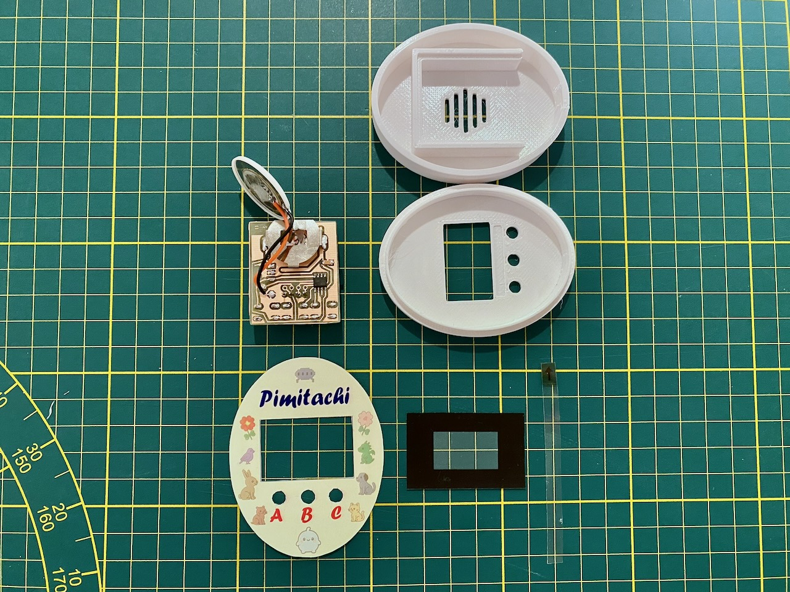
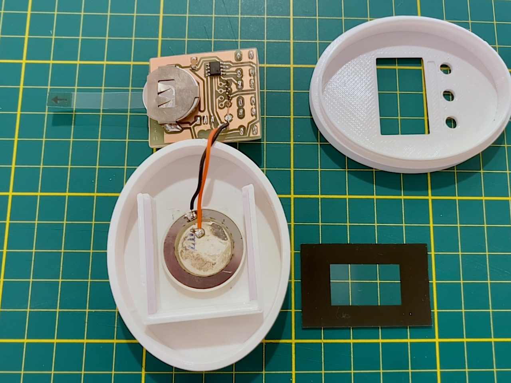
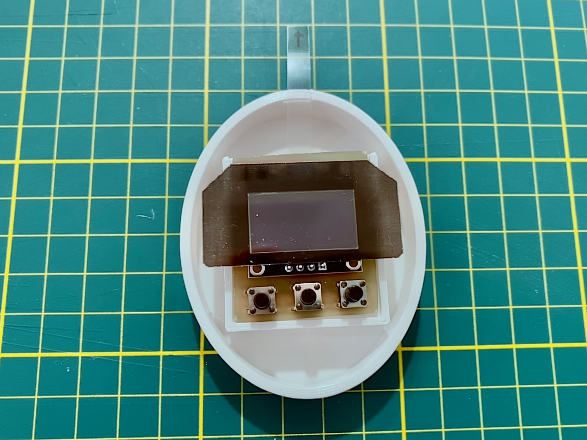
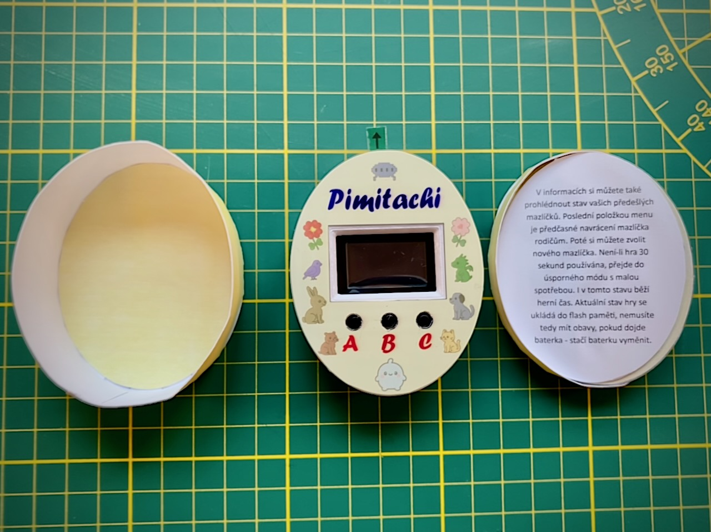

# Case and Labels for Pimitachi

This repository contains the design for a 3D printed case, labels, and files for manufacturing your own PCB for the
**Pimitachi** project – a small pocket game in the style of Tamagotchi based on the inexpensive RISC-V microcontroller
CH32V002 (from the CH32LibSDK library).

Pimitachi is a virtual pet that you take care of (feeding, playing, healing, cleaning, etc.). The game runs on simple
hardware: CH32V002J4M6, 0.96" OLED display (SSD1306, I2C), 3 buttons, piezo buzzer, and a CR2032 battery. The game state
is saved to flash memory, so it survives even a battery replacement (only the clock doesn't run without power).

I manufactured the PCB using a 10W laser engraver (LightBurn project file included). The PCB and piezo buzzer are then
attached to the case with double-sided adhesive tape.

The **assembly process** is documented in the images below.

## Important Notes

- The case is designed for an OLED display with the pinout **GND-VCC-SCL-SDA** (GND on pin 1). If you use a display with
  the reversed order (VCC-GND-SCL-SDA), the display will be positioned higher – you will need to modify the cutout in
  both the case and the label.
- The PCB is inserted into the case **without** the programming pin header.

## Links

- Original Pimitachi project (game description, firmware,
  schematic): https://www.breatharian.eu/hw/ch32libsdk/#pimitachi
- Source code and documentation in CH32LibSDK: https://github.com/Panda381/CH32LibSDK/tree/main/ch32/TOYS/Pimitachi
- Complete CH32LibSDK library: https://github.com/Panda381/CH32LibSDK

## Assembly (Step by Step)

1. Manufacture the PCB – if using a laser engraver, you can use the project file `pimitachi-pcb.lbrn2`.
2. Solder components onto the PCB (including the programming header for flashing).
3. Flash the firmware from CH32LibSDK.
4. Remove the programming header.
5. Attach the PCB and piezo to the case with double-sided tape.
6. Apply the labels and display window overlay.
7. Insert a strip of transparent film under the battery, which is removed before first use of Pimitachi.

## Files in the Repository

### PCB (Laser Manufacturing)

| File                  | Description                                 |
|-----------------------|---------------------------------------------|
| `pimitachi-pcb.lbrn2` | LightBurn project file (10W laser engraver) |
| `pimitachi-pcb.png`   | Modified PCB image                          |

### 3D Case Model

| File                 | Description                                                 |
|----------------------|-------------------------------------------------------------|
| `pimitachi-case.3mf` | File for 3D printing (e.g., in PrusaSlicer or Bambu Studio) |

### Labels and Manual

| File                              | Description                                                                                      |
|-----------------------------------|--------------------------------------------------------------------------------------------------|
| `pimitachi-label.afdesign`        | Source file in Affinity Designer (case label + display window overlay)                           |
| `pimitachi-label-case.pdf`        | Case label (recommended to print on glossy photo paper)                                          |
| `pimitachi-label-transparent.pdf` | Protective display cutout (print on transparent film) – protects the display and hides its edges |
| `pimitachi-manual.pdf`            | Printed manual for Pimitachi game controls (from the original project)                           |