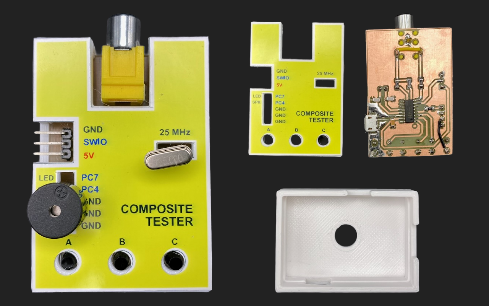
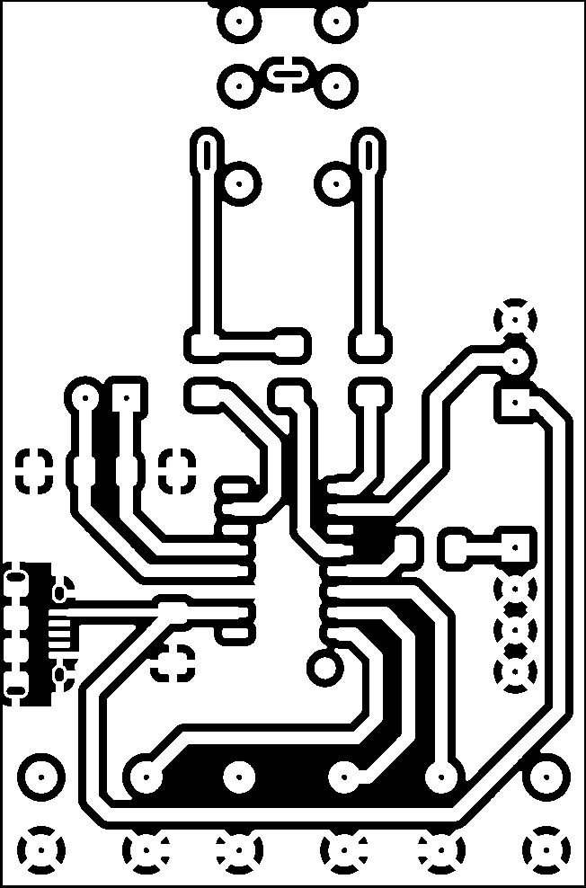
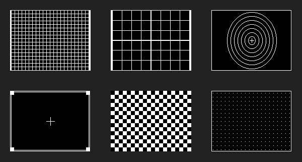

# RCA Tester

A while ago, I purchased a replica of the Sony Walkman CRT screen, which can be found on Chinese
e-shops for a few hundred CZK. The problem is that these screens only support composite video input.
I didn't have any device at home capable of generating a composite video signal. That's why I decided
to create a simple and inexpensive RCA tester.

The RCA Tester serves as both a practical tool for testing composite video displays and a demonstration
of the `rca-library` capabilities. It generates standard PAL composite video signals using just
a cheap RISC-V microcontroller and a few passive components.

**Version 1**



## Features

- **Composite video output** via SPI (hardware) or bit-banging (software)
- **Multiple video modes**: Graphics (pixel-based) and Text (character-based)
- **Test patterns**: 6 pre-built patterns + 2 dynamic patterns
- **Multiple fonts**: Bold, Thin, ZX Spectrum, RVPC, 80-column styles
- **Button input**: 3 buttons with debouncing and auto-repeat
- **Sound synthesis**: PWM audio with melody playback
- **Dual framework support**: Works with both CH32LibSDK and ch32fun

## Supported Microcontrollers

| MCU      | Flash | SRAM | Notes          |
|----------|-------|------|----------------|
| CH32V002 | 16 KB | 4 KB | Default target |
| CH32V003 | 16 KB | 2 KB | Alternative    |

## Video Modes

### Graphics Modes (Pixel-based framebuffer)

| Mode    | Resolution | RAM Usage | Description                 |
|---------|------------|-----------|-----------------------------|
| VMODE 0 | 128x64 px  | ~1.3 KB   | Low resolution, minimal RAM |
| VMODE 1 | 160x120 px | ~2.7 KB   | Higher resolution           |

> **Note:** VMODE 1 requires ~2.7 KB RAM and is only available on CH32V002 (4 KB SRAM).
> CH32V003 with 2 KB SRAM does not have enough memory for this mode.

### Text Modes (Character-based with fonts)

| Mode    | Dimensions  | Font Size | RAM Usage | Description       |
|---------|-------------|-----------|-----------|-------------------|
| VMODE 6 | 40x30 chars | 8x8       | ~1.6 KB   | High density text |
| VMODE 7 | 32x24 chars | 8x8       | ~1.2 KB   | Standard text     |
| VMODE 8 | 23x18 chars | 8x14      | ~0.9 KB   | Large font text   |

## Hardware

**Version 2** (+ PC7 for LED)


### Pin Configuration

| Pin         | Function        | Description                       |
|-------------|-----------------|-----------------------------------|
| **PC6**     | Video Out (SPI) | SPI1_MOSI - hardware video output |
| **PD6**     | Video Out (Alt) | Bit-banging alternative           |
| **PC1**     | Button LEFT/C   | Active-low, internal pull-up      |
| **PC2**     | Button UP/B     | Active-low, internal pull-up      |
| **PC3**     | Button RIGHT/A  | Active-low, internal pull-up      |
| **PC4**     | Audio Out       | PWM on TIM1_CH4                   |
| **PC7**     | LED             | Optional status LED               |
| **PA1/PA2** | Crystal         | External 25 MHz oscillator        |

### Clock Configuration

- **External crystal**: 25 MHz
- **PLL multiplier**: x2
- **System clock**: 50 MHz

### Hardware Design Files

The project is designed for home manufacturing. The `hw/` directory includes everything needed to build the complete
device: a PCB design for a 10W laser, a 3D printable case, and label templates. No professional PCB manufacturing or
specialized equipment (beyond a basic laser engraver and 3D printer) is required.

The `hw/` directory contains all hardware design files:

```
hw/
├── rca-tester/                  # KiCAD 9 project (schematic + PCB) - Version 2
├── rca-tester-case.3mf          # 3D printed case model
├── rca-tester-pcb.lbrn2         # LightBurn project for laser PCB etching - Version 1
├── rca-tester-pcb.png           # PCB image for manual manufacturing - Version 1
├── rca-tester-label.afdesign    # Label template (Affinity Designer)
├── rca-tester-label.docx        # Label template (Word)
└── rca-tester-digram.png        # Block diagram
```

> **Note:** The KiCAD project reflects **Version 2** of the PCB design, which includes these improvements:
> - PC7 pin exposed for optional LED connection
> - Larger crystal socket
>
> The LightBurn/PNG files contain **Version 1** (original design without these features).

#### Manual PCB Manufacturing

The `rca-tester-pcb.lbrn2` and `rca-tester-pcb.png` files are designed for DIY PCB manufacturing using a laser
engraver (10W diode laser recommended).

**Version 1**



### Bill of Materials (BOM)

| Ref     | Component       | Value/Part   | Qty | Notes                                                                                 |
|---------|-----------------|--------------|-----|---------------------------------------------------------------------------------------|
| IC1     | Microcontroller | CH32V002A4M6 | 1   | [AliExpress](https://www.aliexpress.com/item/1005008493381343.html)                   |
| Q1      | Crystal         | 25 MHz       | 1   | HC-49U/S package                                                                      |
| C1      | Capacitor       | 100 nF       | 1   | Ceramic, 1206                                                                         |
| C2, C3  | Capacitor       | 22 pF        | 2   | Ceramic, 1206                                                                         |
| R1      | Resistor        | 470 Ω        | 1   | 1206                                                                                  |
| R2      | Resistor        | 330 Ω        | 1   | 1206                                                                                  |
| R3, R4  | Resistor        | 680 Ω        | 2   | 1206                                                                                  |
| SW1-SW3 | Push Button     | 6x6 mm       | 3   | Tactile switch                                                                        |
| J1      | Header          | 1x4 pin      | 1   | Pin header                                                                            |
| J2      | RCA Connector   | RS-162-DD    | 1   | [GME](https://www.gme.cz/v/1499520/rs-162-zluta-rca-zasuvka)                          |
| J3      | Header          | 1x3 pin      | 1   | Pin header                                                                            |
| J4      | USB Connector   | Micro-B      | 1   | [AliExpress](https://www.aliexpress.com/item/1005007360060905.html) (Micro-28)        |
| BZ1     | Buzzer          | 12 mm        | 1   | [GME](https://www.gme.cz/v/1498245/al-goodwell-al12085mt-p15r-magnetodynamicky-menic) |

Most components are commonly available. The less standard parts with purchase links:

- **RCA Connector (RS-162-DD)** - Available at [GME.cz](https://www.gme.cz/v/1499520/rs-162-zluta-rca-zasuvka)
- **CH32V002A4M6** - RISC-V MCU from WCH, available
  on [AliExpress](https://www.aliexpress.com/item/1005008493381343.html)
- **Micro USB (Micro-28)** - SMD connector, available
  on [AliExpress](https://www.aliexpress.com/item/1005007360060905.html)
- **Buzzer (12 mm)** - Magnetic transducer, available
  at [GME.cz](https://www.gme.cz/v/1498245/al-goodwell-al12085mt-p15r-magnetodynamicky-menic)

## Build System

### Prerequisites

1. **Toolchain**: xpack-riscv-none-elf-gcc (recommended)
    - Download from: https://github.com/xpack-dev-tools/riscv-none-elf-gcc-xpack
    - Note: WCH toolchain has `-flto` bugs, avoid it

2. **Framework** (one of):
    - **CH32LibSDK**: https://github.com/Panda381/CH32LibSDK
    - **ch32fun**: https://github.com/cnlohr/ch32fun

3. **Environment setup**:
   ```bash
   export PATH="/path/to/xpack-riscv-none-elf-gcc/bin:$PATH"
   export CH32_ROOT_PATH="/path/to/CH32LibSDK"
   ```

### Build Scripts

All scripts accept optional parameters: `[sdk] [mcu]`

| Script | Function              | Example                      |
|--------|-----------------------|------------------------------|
| `c.sh` | Build/Compile         | `./c.sh ch32libsdk ch32v003` |
| `d.sh` | Clean                 | `./d.sh`                     |
| `e.sh` | Flash to device       | `./e.sh ch32fun ch32v002`    |
| `r.sh` | Reset device          | `./r.sh`                     |
| `a.sh` | Clean + Build         | `./a.sh`                     |
| `x.sh` | Clean + Build + Flash | `./x.sh`                     |

**Default values**: `sdk=ch32libsdk`, `mcu=ch32v002`

### Quick Start

```bash
# Full rebuild and flash with defaults
./x.sh

# Build for CH32V003 with CH32LibSDK
./x.sh ch32libsdk ch32v003

# Just compile (no flash)
./c.sh

# Clean build artifacts
./d.sh
```

## Configuration

Edit `config.h` to customize the firmware:

### Video Mode Selection

```c
#define VMODE 0     // 0=128x64, 1=160x120, 6=40x30 text, 7=32x24 text, 8=23x18 text
```

### Video Output Method

```c
#define USE_RCA_SPI 1   // 1=SPI hardware (PC6), 0=bit-bang (PD6)
```

### Clock Source

```c
#define USE_HSI 0       // 0=external 25MHz crystal, 1=internal oscillator
```

### Feature Enables

```c
#define USE_KEYS  1     // Enable button input
#define USE_SOUND 2     // 0=disabled, 1=tones only, 2=melody playback
```

## Usage

### Graphics Mode (VMODE 0/1)

The application cycles through 8 test patterns:

1. **Grid** - Regular grid lines
2. **Crosshatch** - Diagonal crossing lines
3. **Circles** - Concentric circles
4. **Border** - Screen border frame
5. **Checkerboard** - Alternating squares
6. **Dots** - Dot matrix pattern
7. **Text** - "RCA Video" text display
8. **Charset** - Full character set display



**Controls**:

- **RIGHT (A)** - Next pattern
- **LEFT (C)** - Previous pattern
- **UP (B)** - Reset to bootloader

### Text Mode (VMODE 6/7/8)

The application showcases different fonts:

- TextModeFontBold8x8
- TextModeFontThin8x8
- TextModeFontZx
- TextModeFontRvpc
- TextModeFont80
- TextModeFont81

## Pattern Conversion

The conversion scripts generate C header files containing the pattern data, which are then included in the project.

### Convert PNG to C array

```bash
cd patterns

# For VMODE 0 (128x64)
python3 convert.py vmode0/01_pattern_grid.png > pattern_grid.h

# For VMODE 1 with RLE compression (160x120)
python3 convert_rle.py vmode1/01_pattern_grid.png > pattern_grid_rle.h
```

### Requirements

- Python 3
- Pillow library: `pip3 install pillow`

## Dependencies

### rca-library

The shared video generation library located at `../rca-library/`:

- Video signal timing and generation
- Multiple font files (8x8, 8x14, various styles)
- SPI and bit-bang rendering modes
- Frame callback mechanism

### Frameworks

Both frameworks are included in the repository as git submodules in `../sdk/`:

```bash
# Initialize submodules after cloning
git submodule update --init --recursive
```

**CH32LibSDK** by Miroslav Nemecek (Panda38):

- https://github.com/Panda381/CH32LibSDK
- Location: `../sdk/CH32LibSDK/`
- Full peripheral drivers
- Comprehensive hardware abstraction

**ch32fun** by CNLohr:

- https://github.com/cnlohr/ch32fun
- Location: `../sdk/ch32fun/`
- Lightweight alternative
- Minimal overhead

## License

MIT License - See source file headers for details.

Portions derived from CH32LibSDK by Miroslav Nemecek (Panda38) retain their original license.

## Links

- [CH32LibSDK](https://github.com/Panda381/CH32LibSDK)
- [ch32fun](https://github.com/cnlohr/ch32fun)
- [RISC-V Toolchain](https://github.com/xpack-dev-tools/riscv-none-elf-gcc-xpack)
