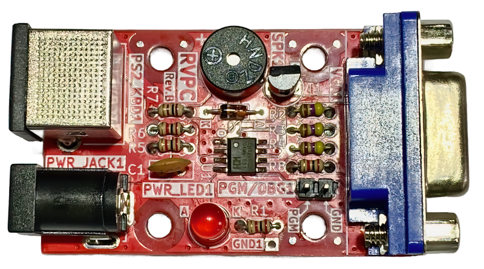
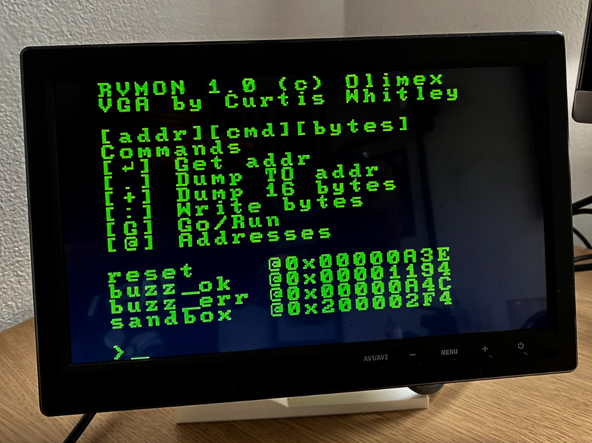
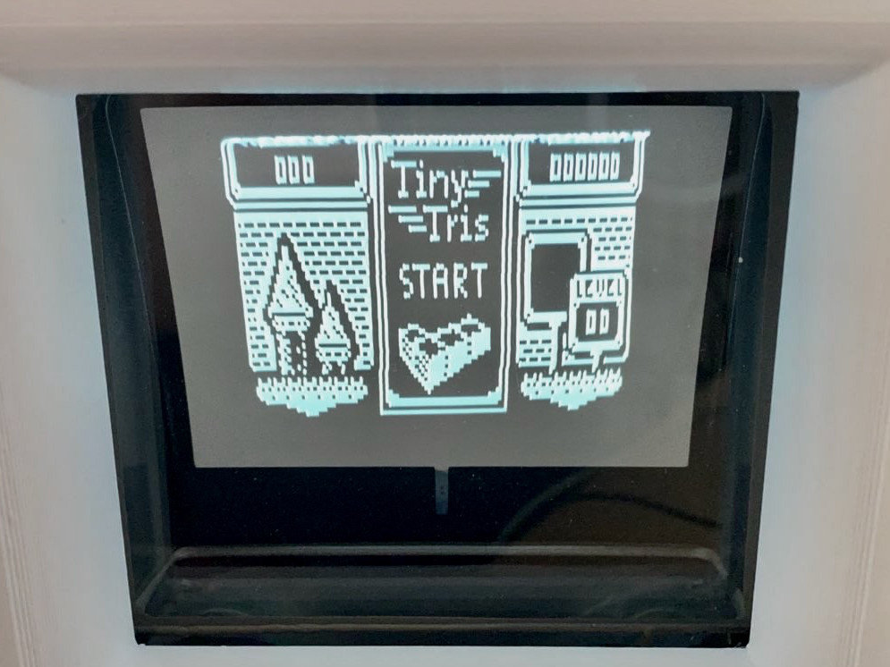
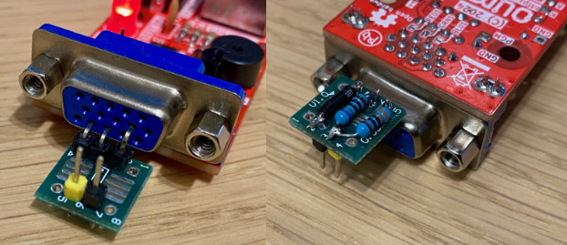
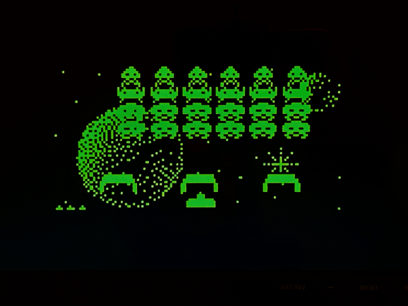
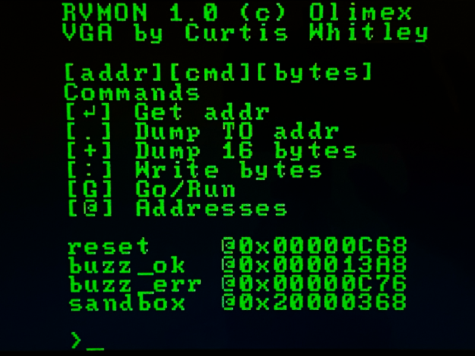
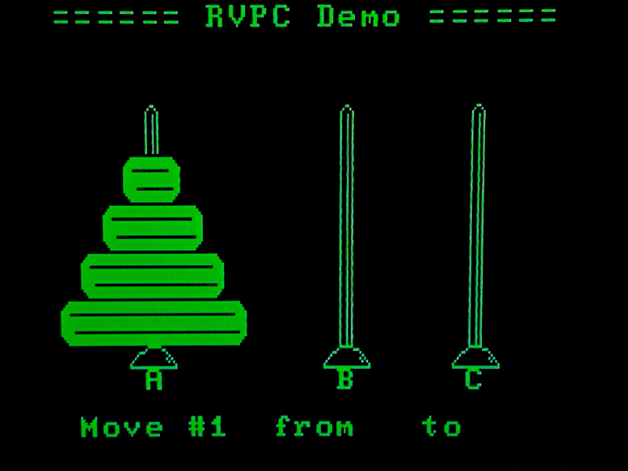
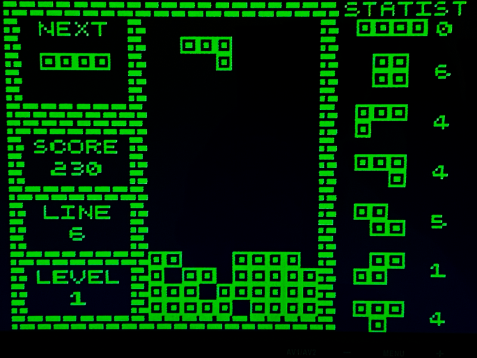

# RVPC Port to CH32LibSDK

This project is a port of the RVPC (the EURO 1.00 RISC-V personal computer with VGA, keyboard, and Woz-like monitor)
from Olimex to the CH32LibSDK. Thanks to this port, the original RVPC gains the following improvements:

- Higher-quality VGA output
- Games from TinyGames by [@Electro_L_I_B](https://x.com/Electro_L_I_B)
- For RVPC with CH32V002, additional games for BabyPad by [@NemecekPanda38](https://x.com/NemecekPanda38)



## Video Output Options

RVPC supports two video output standards:

### **VGA Output** (default)

Standard VGA output via bit-banging on GPIOC for CRT monitors and VGA displays. Uses hardware timer (TIM2) for HSYNC/VSYNC generation with precise timing at 640×480@60Hz or 720×576@~48Hz (text mode).



### **RCA Composite Output**

PAL-like composite video signal via bit-banging on PD6 pin for TVs with RCA input.



**Enable RCA mode:**

```bash
export USE_RCA=1
./c.sh

or

./c.sh ch32v003 1
```

**Wiring for RCA (5V supply):**

```
              CH32V003 / MCU         RVPC VGA CONNECTOR                   RCA CINCH
          ┌────────────────────┐     ┌────────────────┐                 ┌───────────┐
          │                    │     │                │             ┌───┘-----------│
Pin 1 --->│ PD6  (VIDEO OUT)   │---->│ pin 14 VSync   │-- 330 Ω --> │               │
          │                    │     │                │             │ Center (sig)  │
Pin 5 --->│ PC1  (SYNC OUT)    │---->│ pin 13 HSync   │-- 680 Ω --> │               │
          │                    │     │                │             └───┐-----------│
Pin 8 --->│ GND                │---->│ pin 8 GND      │---------------->└───────────┘
          │                    │     │                │                  Shield (GND)
          └────────────────────┘     └────────────────┘                                                                                                                       

VGA F connector:

  ┌───────────────────────┐
  │  ●   ●   ●   ●   ●    │    5  4  3  2  1
  │    ●   ●   ●   ●   ●  │     10  9  8  7  6
  │  ●   ●   ●   ●   ●    │    15 14 13 12 11
  └───────────────────────┘

PD6 (Pin 1) -> 330Ω resistor -> VIDEO signal (RCA center pin), VGA PIN 
PC1 (Pin 5) -> 680Ω resistor -> SYNC combined with VIDEO
GND (Pin 8) -> GND (RCA shield)
```



The resistor network creates proper composite video levels:

- Sync level: ~0.3V (680Ω divider dominates)
- Black level: ~0.3V (video off, sync off)
- White level: ~1V (330Ω pulls up when video is high)

**Technical specs:**

- Frame timing: 312 lines per frame (PAL-like)
- Frame rate: ~50 Hz
- Line rate: ~15.65 kHz
- HSYNC pulse: ~4.7 µs
- Pixel clock: ~50 MHz (trimmed HSI oscillator)

**Note:** HSI oscillator is not crystal-accurate. If display shows rolling or unstable sync, adjust `TIM2_InitPWM`
period value (default 3194) in `rvpc_vga.c`:

- If line rate < 15.625 kHz: decrease period (e.g., 3193, 3192...)
- If line rate > 15.650 kHz: increase period (e.g., 3195, 3196...)

---

## Supported Video Modes

### Video Mode Comparison

| Mode        | Resolution  | Output    | MCU           | RAM Usage | Description                            |
|-------------|-------------|-----------|---------------|-----------|----------------------------------------|
| **VMODE 0** | 128×64      | VGA + RCA | CH32V003/V002 | 1024 B    | Graphics mode with 4× vertical scaling |
| **VMODE 1** | 160×120     | VGA + RCA | CH32V002 only | 2400 B    | Graphics mode with 2× vertical scaling |
| **VMODE 8** | 23×18 chars | VGA + RCA | CH32V003/V002 | 414 B     | Text mode with custom 8×8 fonts        |

The original RVPC with CH32V003 supports two video modes (both VGA and RCA):

### **VMODE 0**

Graphic mode with 128x64 resolution

**TinyGames** by [@Electro_L_I_B](https://x.com/Electro_L_I_B):

- [TArkan](games/TArkan)
- [TBert](games/TBert)
- [TBike](games/TBike)
- [TBomber](games/TBomber)
- [TDDug](games/TDDug)
- [TDoc](games/TDoc)
- [TInvader](games/TInvader)
- [TMissile](games/TMissile)
- [TMorpion](games/TMorpion)
- [TPipe](games/TPipe)
- [TPlaque](games/TPlaque)
- [TSQuest](games/TSQuest)
- [TTrick](games/TTrick)
- [TTris](games/TTris)

**TINVADERS**



### **VMODE 8**

Text mode 23x18 with an 8x8 pixel font using the original RVPC font

Original RVPC software ported to CH32LibSDK:

- [demo-rvmon](games/demo-rvmon)
- [demo-tetris](games/demo-tetris)
- [demo-towers](games/demo-towers)
- [demo-towers-interactive](games/demo-towers-interactive)

**RVMON**



**TOWERS**



For RVPC with CH32V002, an additional video mode is available:

### **VMODE 1** (CH32V002 only)

Graphic mode with 160x120 resolution. Available for both VGA and RCA outputs, but requires CH32V002 due to memory constraints.

**Memory requirements:**

- Frame buffer: 2400 bytes (160×120 / 8)
- Requires CH32V002 (4KB RAM) - too large for CH32V003 (2KB RAM)
- Works with both VGA and RCA output

**Technical details:**

- Vertical scaling: 2× (120 source lines → 240 scanlines)
- VGA: Standard VGA 640×480@60Hz timing with bit-banging on GPIOC
- RCA: ~13 cycles/pixel (optimized for 160 pixels on PAL line), 240 active scanlines
- Aspect ratio: ~4:3

BabyPad/BabyPC games by [@NemecekPanda38](https://x.com/NemecekPanda38):

- [ch32v002-Eggs](games/ch32v002-Eggs)
- [ch32v002-Fifteen](games/ch32v002-Fifteen)
- [ch32v002-Invaders](games/ch32v002-Invaders)
- [ch32v002-Life](games/ch32v002-Life)
- [ch32v002-Tetris](games/ch32v002-Tetris)
- [ch32v002-Train](games/ch32v002-Train)
- [ch32v002-TVTennis](games/ch32v002-TVTennis)

**TETRIS**



## Links

- [Olimex RVPC](https://www.olimex.com/Products/Retro-Computers/RVPC/open-source-hardware)
- [Olimex RVPC Original Firmware](https://github.com/OLIMEX/RVPC)
- [TinyJoypad](https://www.tinyjoypad.com)
