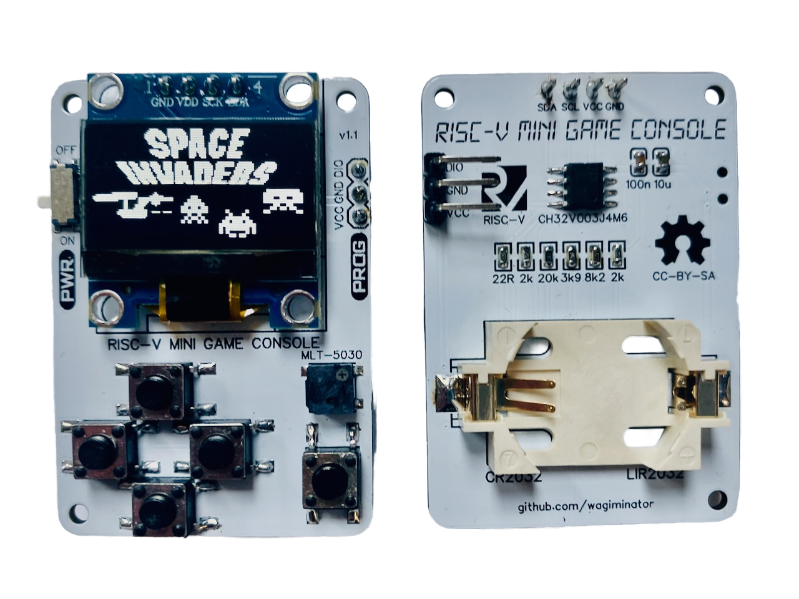
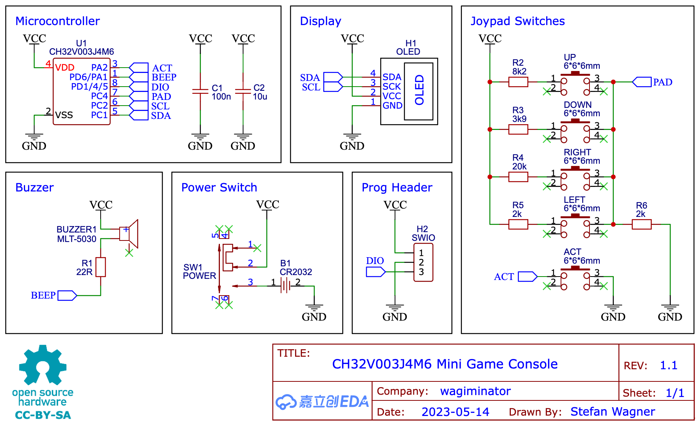
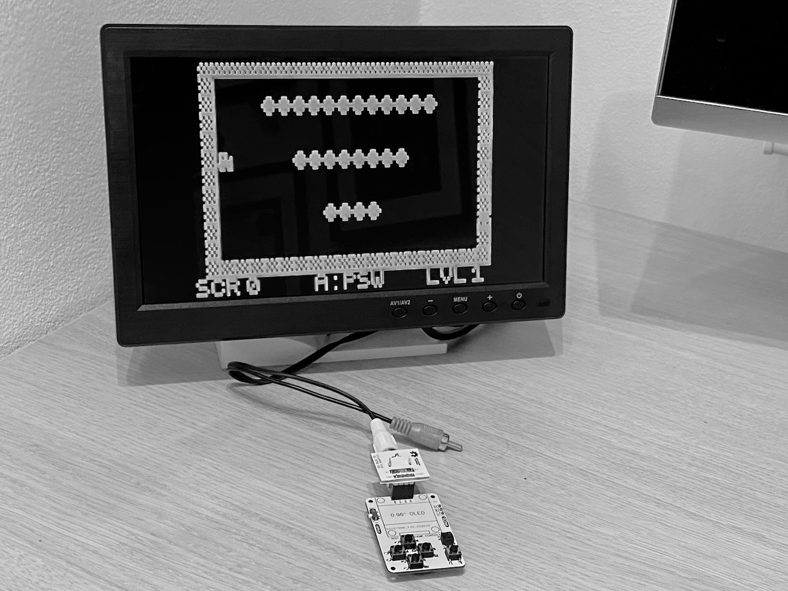
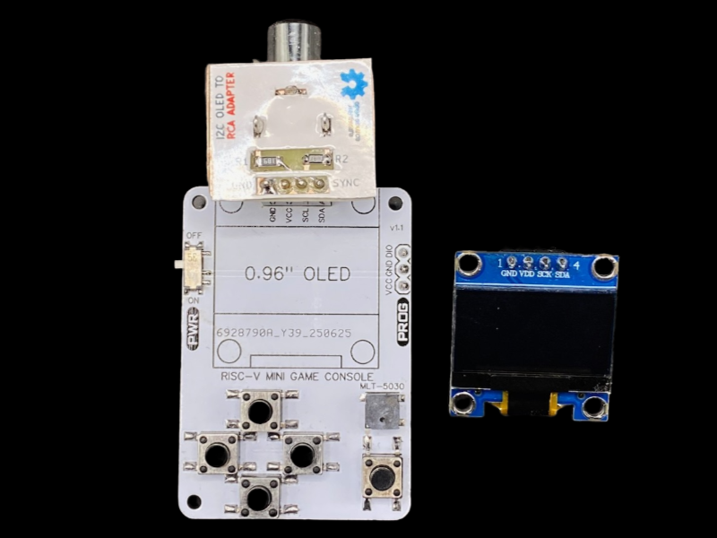
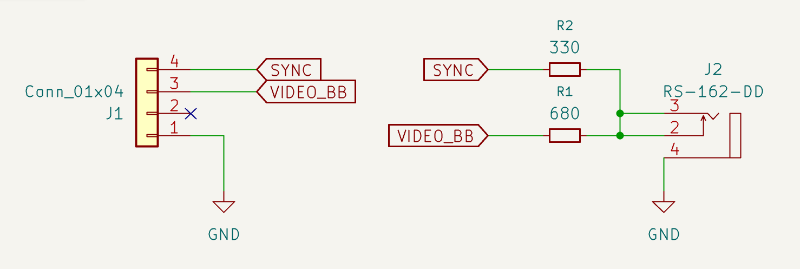
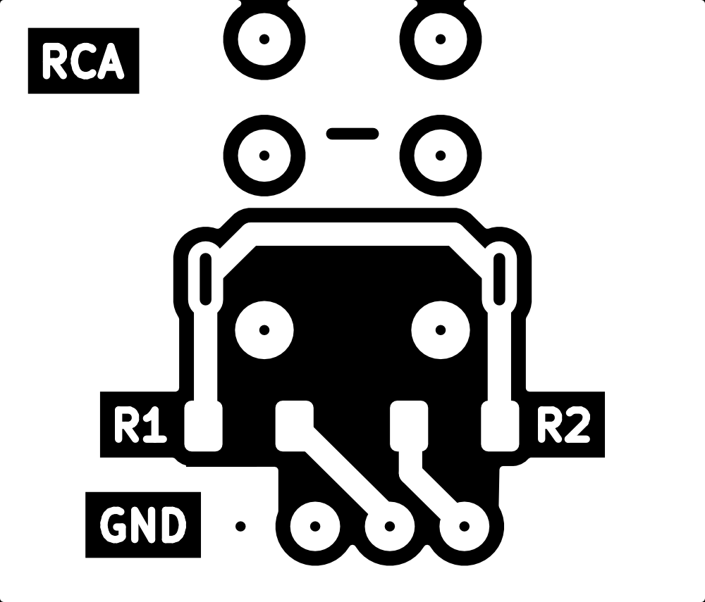

bu# Tinyboy

**Tinyboy console** is based on the [CH32V003-GameConsole](https://github.com/wagiminator/CH32V003-GameConsole) project
by Stefan Wagner.  
Instead of the now discontinued CH32V003, it uses the newer **CH32V002J4M6** MCU.  
I used version 1.1 of the PCB design, which does not include the transistor for the buzzer.

**CH32V003-GameConsole PCB v1.1**

- https://oshwlab.com/wagiminator/ch32v003j4m6-game-console
- https://github.com/wagiminator/CH32V003-GameConsole/tree/main/hardware



---

## Schematic

The Tinyboy console does **not include the 6th button (KEY_B)**. Fortunately, most games in **CH32LibSDK** do not
require this button.



---

## Video Output

TinyBoy supports two video output options:

### OLED Display (I2C)

The default video output uses a **0.96" I2C OLED display** (128×64 pixels, SSD1306 controller).
This is the standard configuration inherited from the original CH32V003-GameConsole design.

### RCA Composite Video

As an alternative, you can output video to a **TV or monitor** via composite video (RCA connector).
This mode uses the [rca-library](../rca-library/) from this repository.





The I2C pins are repurposed with a simple resistor DAC:

| Pin | Resistor | Signal |
|-----|----------|--------|
| SDA | 330Ω     | SYNC   |
| SCL | 680Ω     | VIDEO  |
| GND | —        | GND    |

Connect SYNC + VIDEO to the **center pin** of the RCA connector, and GND to the **outer ring**.

#### RCA Connector Adapter

A simple adapter PCB is available in [hw/rca-connector](hw/rca-connector/) (KiCad project).

**Schematic:**



**PCB for manual fabrication:**



**Additional files:**

- [rca-connector-label.pdf](hw/rca-connector-label.pdf) – printable labels
- [rca-connector.lbrn2](hw/rca-connector.lbrn2) – LightBurn project file (for 10W laser engraver)

#### Build Configuration

Each game directory contains shell scripts for building and flashing:

| Script | Description                        |
|--------|------------------------------------|
| `c.sh` | Compile (incremental build)        |
| `a.sh` | All – clean + compile              |
| `d.sh` | Delete – clean build artifacts     |
| `e.sh` | Export – flash to hardware + reset |
| `r.sh` | Reset device                       |
| `x.sh` | Full rebuild + flash (a.sh + e.sh) |

The video output is selected by passing `0` (OLED) or `1` (RCA) as argument:

```bash
# Build for OLED display (default)
./c.sh 0

# Build for RCA composite video output
./c.sh 1

# Full clean rebuild + flash for RCA
./x.sh 1
```

For RCA mode, you can also select the video resolution using `VMODE` environment variable:

| VMODE | Resolution | Framebuffer |
|-------|------------|-------------|
| 0     | 128×64     | 1024 B      |
| 1     | 160×120    | 2400 B      |

```bash
# Build for RCA with higher resolution
VMODE=1 ./c.sh 1
```

**Note:** RCA mode uses a different clock configuration (50 MHz via PLL instead of 24 MHz HSI) to achieve accurate video
timing.

---

## Programming

Programming the console is straightforward using the **WCH-LinkE programmer**.  
Simply connect:

- **SWDIO** from programmer → **DIO**
- **3V3**
- **GND**

The standard tool is **WCH-LinkUtility**, but it is **only available for Windows**.  
For Linux and macOS, alternatives are needed:

### [rvprog](https://github.com/wagiminator/MCU-Flash-Tools?tab=readme-ov-file#rvprog)

- Easy installation (`pip install rvprog`)
- Limitation: fails to upload larger programs (>10 KB) completely into MCU flash

### [minichlink](https://github.com/cnlohr/ch32fun/tree/master/minichlink)

- The **most reliable tool** in my experience
- Can reset the MCU even without the reset pin connected
- Automatically detects the WCH-LinkE programmer
- Supports alternative programmers (e.g., via **esp32s2chfun**)
- Drawback: must be compiled manually
    - On macOS I had to remove support for `b003boot` and `esp32s2chfun` to build successfully

Prebuilt binaries for **macOS** and **Linux** are available in the `../tools` folder.

---

## Battery Measurement

A nice advantage of the Tinyboy console is that it has **no voltage regulator** – the MCU is powered directly from the
battery. This allows you to **measure the battery voltage** using the internal **1.2 V reference** of the CH32V002.

### Example Usage

```c
// The value bat will return the battery voltage in millivolts (mV).

BatInit();
const u32 bat = GetBat();
BatTerm();
```

**Notes**

- The function uses ADC1 in single conversion mode.
- The computation scales the internal 1.2 V reference to the actual supply voltage.
- If you use the KEY service, it must be temporarily disabled while reading the ADC.
- Returns the voltage in millivolts (mV).

---

## Expansion Possibilities

Because the MCU is in an **SOP-8 package**, the number of available pins is very limited.  
Still, some expansions are possible:

- The **OLED pins** can also be used to connect an **I2C sensor**.  
  With software I2C, you can easily turn the console into a **simple sensor device**.

- Another option is to reuse the **SWIO programming pin**.  
  The SDK provides functions to remap it:

```c
// PD1 as standard GPIO
GPIO_Remap_SWD(4);

// Restore PD1 as SWIO (programming)
GPIO_Remap_SWD(0);
```

⚠️ **Warning:** After remapping PD1 to GPIO, programming will no longer work.  
The only recovery option is a **power cycle erase** ("unbrick chip").  
It is therefore wise to add a small delay at the start of `main()` to allow erasing via programmer,  
or only remap this pin after pressing a button.

---

## Assembly

Assembly is relatively simple, but some parts (battery holder, on/off switch, buzzer) may be harder to source.  
**Tip:** Solder the OLED display **last** – otherwise it becomes tricky to mount the on/off switch properly.

With PCB ordered from JLCPCB, the total cost is around **100–200 CZK** (≈ 4–8 EUR).

---

## Parts List

| Component                        | Link                                                                                                                                                                                                                                                 | Price    |
|----------------------------------|------------------------------------------------------------------------------------------------------------------------------------------------------------------------------------------------------------------------------------------------------|----------|
| **MCU CH32V002J4M6**             | [AliExpress](https://www.aliexpress.com/item/1005009035485168.html)                                                                                                                                                                                  | ~2 Kč    |
| **Buzzer – MLT-5030**            | [AliExpress](https://www.aliexpress.com/item/1005008979086407.html)                                                                                                                                                                                  | ~8 Kč    |
| **Battery Holder (CR2032)**      | [AliExpress](https://www.aliexpress.com/item/1005005960185390.html), [TME](https://www.tme.eu/cz/details/ch28-2032/baterie-pouzdra-i-drzaky/comf/ch28-2032lf/)                                                                                       | 6–25 Kč  |
| **Rechargeable Battery LIR2032** | [Laskakit](https://www.laskakit.cz/lir2032-li-ion-baterie-40mah-3-6v/), [AliExpress](https://www.aliexpress.com/item/1005008971074671.html)                                                                                                          | 16–58 Kč |
| **I2C OLED 0.96" (128x64)**      | [Pajenicko](https://pajenicko.cz/graficky-oled-displej-096-128x64-i2c-bily), [AliExpress](https://www.aliexpress.com/item/1005006141235306.html)                                                                                                     | 40–89 Kč |
| **ON/OFF Switch**                | [Laskakit](https://www.laskakit.cz/alps-ssss811101-posuvny-prepinac-5vdc-300ma--smd/), [TME](https://www.tme.eu/cz/details/cus-12tb/posuvne-prepinace/nidec-copal-electronics/), [AliExpress](https://www.aliexpress.com/item/1005006710234187.html) | 3–22 Kč  |
| **Tactile Buttons (6×6 mm)**     | [Pajenicko](https://pajenicko.cz/mikrospinac-6x6x5mm-1ts005f), [Laskakit](https://www.laskakit.cz/tlacitko-6x6x5mm/), [Laskakit SMD](https://www.laskakit.cz/tlacitko-smd-6x6x8mm/)                                                                  | ~2 Kč    |
| **RS-162 - RCA connector**       | [GME](https://www.gme.cz/v/1499520/rs-162-zluta-rca-zasuvka)                                                                                                                                                                                         | ~11 Kč   |

---

## Notes & Recommendations

- Games from **CH32LibSDK** run smoothly despite the missing **KEY_B button**.
- For portable use, a **rechargeable LIR2032** is recommended instead of a standard CR2032, as some games and the OLED
  can quickly drain a regular battery.
- The design is compact and inexpensive, making it a great **DIY retro handheld project**.  
